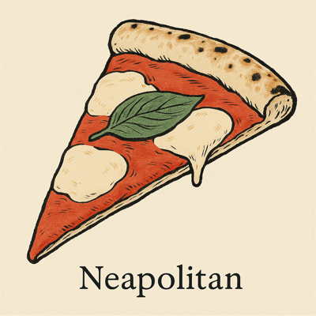

# AI Prompts for Generating Illustrations of Pizza Styles

## Introduction

This project documents AI prompts for generating illustrations of regional
pizza styles. Each prompt file includes details on the AI model and parameters
used to enable reproducibility, subject to the limitations of the model's
determinism.

## Layout of the Project

Each pizza style directory contains pairs of files with identical basenames but
different extensions. One is a Markdown file for the prompt, and the other is
the resulting image.

The base filename has the format `<pizza style>-<ai model>-<prompt version
string>.{md,png}` where
- **Pizza style**: The commonly recognized name for the style (e.g.,
  Neapolitan, Sicilian)
- **AI model** : The name of the model used (e.g., gpt-4o). Tuning details are
  included in the prompt file.
- **Prompt version**: Uses semantic versioning (`vMAJOR.MINOR.REVISION`)

### Example

- `neapolitan-gpt-40-v1.0.0.md` is the prompt file in markdown format with full
  model details.
- `neapolitan-gpt-40-v1.0.0.png` is the resulting image file.

## How to contribute

Fork this repository. Add a pair of Markdown and image files to an existing or
new pizza style directory. Follow the format of existing prompt files for
consistency. Then open a
[pull request](https://github.com/vincentl/ai-pizza-illustrations/pulls).

## License

[AI Pizza Illustrations](https://github.com/vincentl/ai-pizza-illustrations) ©
2025 by [Vincent Lucarelli](https://github.com/vincentl).
Licensed under [CC BY-SA 4.0](https://creativecommons.org/licenses/by-sa/4.0/)

- All markdown files in this repository are covered by **CC BY-SA 4.0**. 
- Generated images are subject to the most restrictive combination of CC BY-SA
  4.0 and any license or usage restrictions imposed by the AI model or its
  provider.

